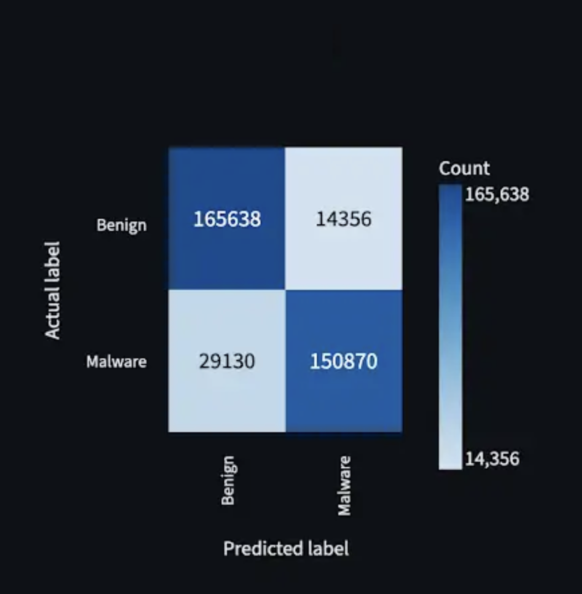
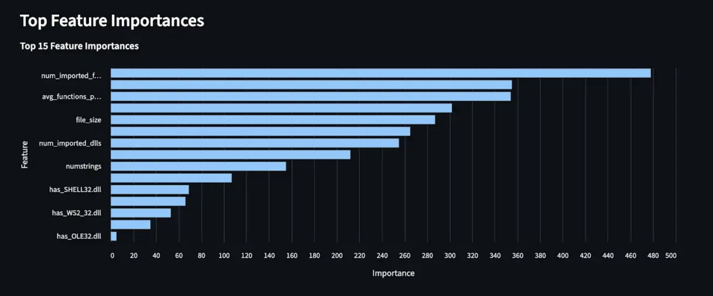
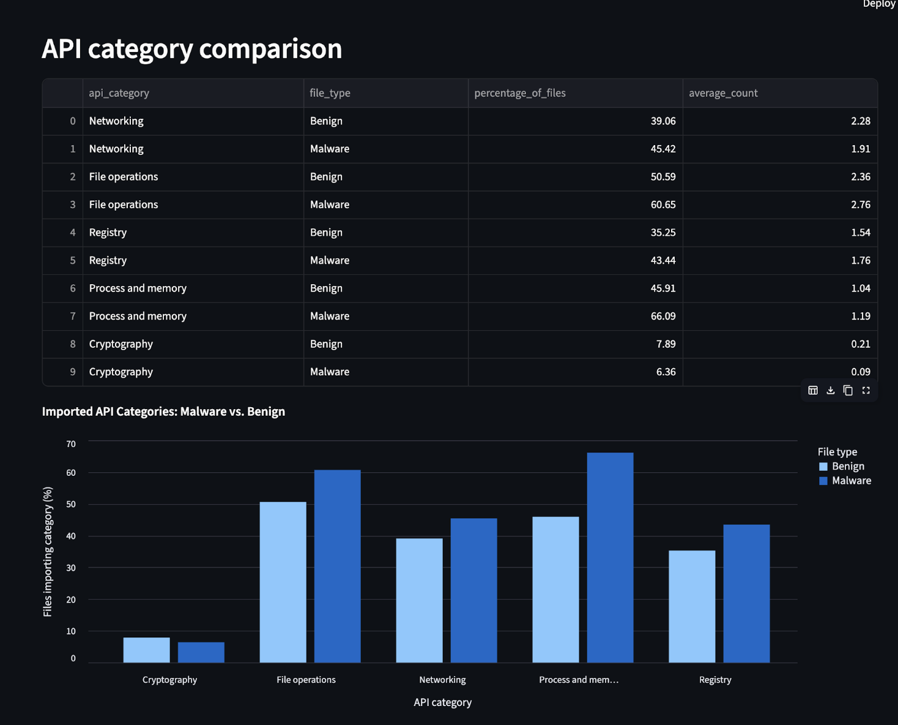
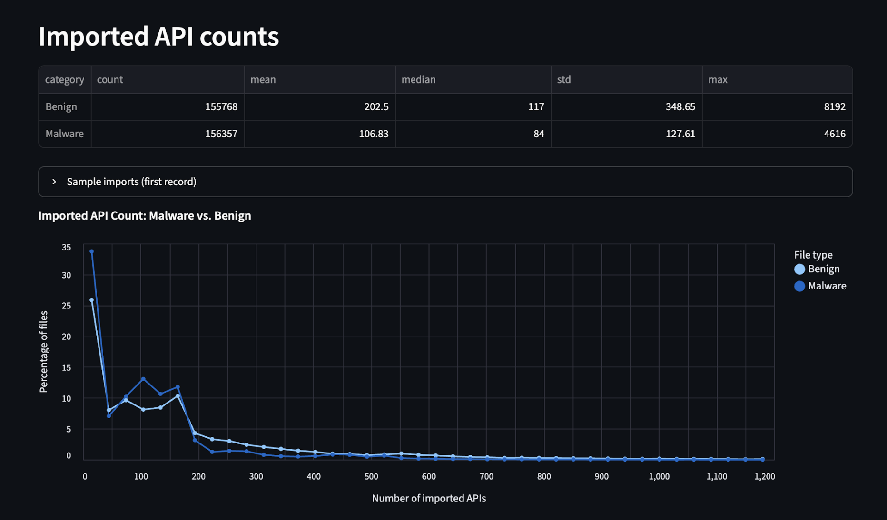

# Malware Classification and Detection

**A Cascaded Machine Learning Approach using the EMBER2024 Dataset**

---

## Team

| Name | Role |
|------|------|
| Lorena Sarasua-Fernandez | Collaborator |
| Sophie Liu | Collaborator |
| Brandon Jaipersaud | Collaborator |
| Chuks Ofojuah | Collaborator |
| Sharon Owusu | Collaborator |
| Atharva Sasankar | Collaborator |

---

## Overview

Malware detection is a cybersecurity process that aims to identify whether a file is malicious or benign before it can damage a system. Despite the effectiveness of traditional detection methods, the consistent emergence of new malware creates a bottleneck — which is where machine learning comes in.

This project uses a portion of the **EMBER2024** dataset to investigate whether an ML model can accurately classify files as malicious or benign. For files identified as malicious, we further explore whether their **behavioral tags** can be extracted. Through responsible AI practices and a cascaded model design, we evaluate how well a model can detect modern malware and characterize its behavior.

---

## Why This Matters

As cyber threats evolve, traditional signature-based detection struggles against newly emerging or modified malware. As individuals, businesses, and governments grow increasingly dependent on digital systems, improving automated detection has become a critical cybersecurity challenge.

Machine learning can learn patterns from known malware samples and apply that knowledge to previously unseen examples — helping to strengthen current defenses. Improving automated classification also helps security professionals respond faster and more consistently, and our findings may shed light on the strengths and limitations of different ML approaches for malware analysis.

---

## Dataset

**EMBER2024** — a large-scale benchmark dataset for holistic malware classification.

- [Main KDD Research Paper](https://arxiv.org/abs/2506.05074)
- [CrowdStrike Blog: EMBER2024](https://www.crowdstrike.com/en-us/blog/ember-2024-advancing-cybersecurity-ml-training-on-evasive-malware/)
- [Medium Breakdown of EMBER2024](https://zhanghaolin66.medium.com/ember2024-a-new-benchmark-for-holistic-malware-classification-62dcb260b47a)

---

## Approach: Cascaded Model Design

### Stage 1 — Binary Classification (Malicious vs. Benign)

The first model uses **LightGBM** to determine whether a given file is malicious or benign.

LightGBM is a tree-based supervised learning algorithm that builds an ensemble of decision trees sequentially — each tree correcting the errors of the previous one. Compared to a single decision tree (prone to overfitting) or a random forest (independent trees), gradient boosting builds trees in a directed, more effective way on structured data. LightGBM is also optimized for speed and memory efficiency at scale, making it well-suited for a dataset as large as EMBER2024.

### Stage 2 — Multiclass Behavior Classification

Files flagged as malicious by Stage 1 are passed to a second **LightGBM** model that identifies *what* the malware does — whether it encrypts files, exfiltrates data, logs keystrokes, etc.

This is a multiclass problem where each file is assigned a behavioral tag from the EMBER2024 set. LightGBM was chosen for this stage because it handles class imbalance well and performs strongly on structured and tabular data.

---

## Results

### Binary Classification (Malicious vs. Benign)
| Model | Accuracy | ROC AUC | Train Samples | Test Samples |
| -------- | -------- | -------- | -------- | -------- |
| LGBMClassifier | 87.92%  | 0.9574 | 312,125 | 359,994 |

- Correctly detected 150,870 out of 180,000 malware samples.
- 14,356 false positives (*benign files flagged as malware*)
- 29,130 false negatives (*actual malware missed*)

<figure>
  
  <figcaption><i>Figure 1: This is the confusion matrix.</i></figcaption>
</figure>

*Figure 1: This is the confusion matrix.*

*Figure 2: This is the feature importance.*

*Figure 3: These are the API categories.*

*Figure 4: These are the imported API counts.*

---

## References

1. Anderson, H.S. et al. — [EMBER2024 KDD Paper](https://arxiv.org/abs/2506.05074)
2. CrowdStrike — [EMBER2024: Advancing Cybersecurity ML Training on Evasive Malware](https://www.crowdstrike.com/en-us/blog/ember-2024-advancing-cybersecurity-ml-training-on-evasive-malware/)
3. [Google Scholar: Papers citing EMBER](https://scholar.google.com/citations?user=G0hRn-wAAAAJ&hl=en)
4. Ke, G. et al. — [LightGBM: A Highly Efficient Gradient Boosting Decision Tree (NeurIPS 2017)](https://proceedings.neurips.cc/paper_files/paper/2017/file/6449f44a102fde848669bdd9eb6b76fa-Paper.pdf)
5. [LightGBM Documentation](https://lightgbm.readthedocs.io/en/stable/)
6. [XGBoost vs LightGBM (Medium)](https://mr-amit.medium.com/xgboost-vs-lightgbm-b6ca76620156)
7. [RandomForestClassifier — scikit-learn](https://scikit-learn.org/stable/modules/generated/sklearn.ensemble.RandomForestClassifier.html)
